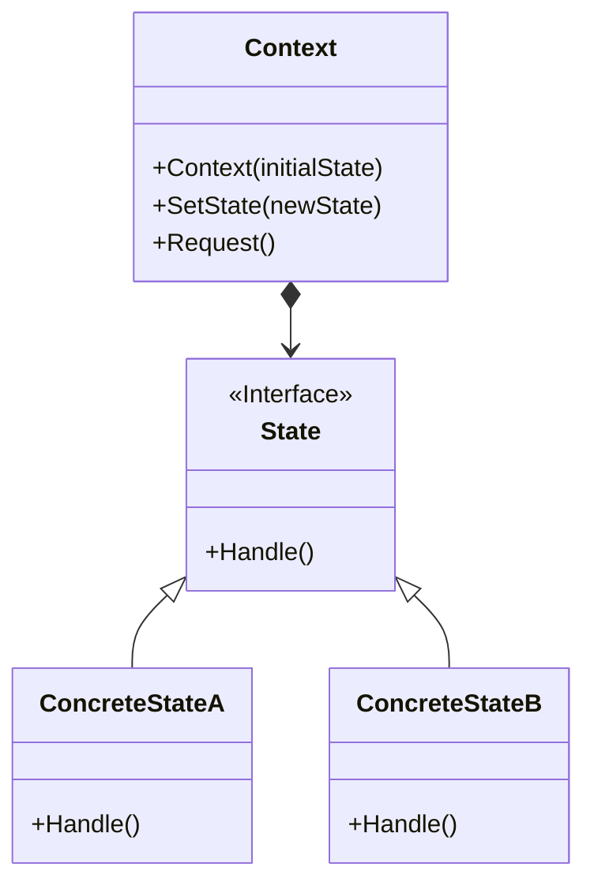

# An Example of State Design Pattern with C#

## What is State Design Pattern?
>State is a behavioral design pattern that lets an object alter its behavior when its internal state changes. 

## When can you use State Design Pattern?
 * When an object needs to behave differently depending on its current state
 * The number of states is enormous, and 
 * The state-specific logic needs to be seperated
 
## Components in State Design Pattern
* Context
  > Stores a reference to one of the concrete state objects and delegates to it all state-specific work. The context communicates with the state object via the state interface. The context exposes a setter for passing it a new state object.
* State
  > Defines interface for declaring what each concrete state should do.
* Concrete State
  >Provides implementation for methods defined in State.

